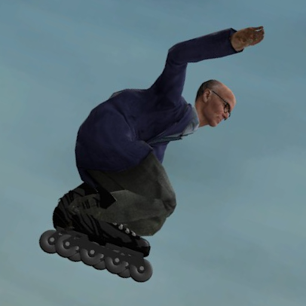

# 🛼 Gmod Inline Skates

Inline skates you can actually skate on in Garry's Mod. Push off stride by stride, carve into corners, crouch and jump,
grab your skates, flip, spin and fall over spectacularly. Your character skates for real: their legs push out to the
side, their arms swing with every stride, they crouch into jumps, tuck down for speed and pull their knees up for
tricks.

## Installing
**Manually:** download this repository and put the contents of this repo in an `inline_skates` folder in
`garrysmod/addons/`.

## Getting started
1. Open the spawn menu (**Q**), go to **Entities → Rides** and spawn the **Inline Skates**.
2. Walk up to them and press **E** to put them on. You're standing on them right where you stood, facing where you
   looked.
3. Hold **W** to push off and use **A** / **D** to steer.

Press **E** again to take them off: they're left standing where you were.

## Controls

### Skating
| Key | Action |
|---|---|
| W | Push off. Rolling backwards, brake first. In the air, tip forward |
| S | Brake. When standing still, skate backwards. In the air, tip back |
| A / D | Steer, leaning into the turn. When standing still, step round on the spot |
| R | Turn round, from skating forwards to backwards or back, keeping your speed |
| W (above the top of a quarter pipe) | Spine transfer: carries you over the top and into the quarter pipe behind it |
| Shift | Sprint: longer, faster strides |
| Ctrl | Tuck down low: no pushing, but less drag, so you pick up speed downhill |
| Space (hold) | Crouch, charging the jump. Let go to jump: the longer you held, the higher |
| E | Take the skates off |

> [!TIP]
> You skate in third person. Prefer first person? Turn off **Third person** under **Options → Inline Skates → Client**,
> or run `inline_skates_cam_third_person 0` in the console.

> [!TIP]
> Skating backwards, the camera looks the way you're going and A / D still turn you the way you'd expect from it. Prefer
> the camera to stay behind your back? Turn off **Camera looks where you go** under
> **Options → Inline Skates → Client**.

> [!TIP]
> Hitting a wall hard, or rolling fast into a curb you can't roll over, knocks you over. Jump up curbs instead.

> [!TIP]
> Water slows you down, and skating in until you're half under knocks you over. Server admins can change both under
> **Water** in the server settings.

### Tricks
| Trick | When | Keys | Notes |
|---|---|---|---|
| Spin | In the air | A / D | Spins in half turns: 180, 360, 540... Keep holding for more |
| Backflip / front flip | In the air | Double-tap S / W | Keep holding the second press for more flips |
| Safety grab | In the air | Right mouse | Knees up, right hand grabs the right skate. Lasts as long as you hold it |
| Mute grab | In the air | Left mouse | The right skate crosses in front and your left hand grabs its toe |
| Christ air | In the air | Ctrl | Legs straight, back arched, arms spread wide |

> [!TIP]
> Land your flips upright and your spins facing along the way you're going: forwards or backwards both work, but
> sideways knocks you over. Let go of the keys early and the trick finishes the turn by itself. In the air you're
> turned to come down square on your skates, onto whatever you're about to land on, such as the slope of a ramp or back
> down a quarter pipe. Coming out of a flip tilted anyway? Press W or S to tip forward or back before you land. Server
> admins can turn the help off with **Landing assist** in the server settings.

> [!TIP]
> Landed a 180? You carry on skating backwards: hold S to keep pushing, or press R to turn round and face forwards
> again.

> [!TIP]
> Tricks combine: try a backflip safety grab by double-tapping S, then holding right mouse.

## Settings
Open the spawn menu and go to **Options → Inline Skates**. Changes apply straight away, so you can tweak things while
skating.

- **Client** is just for you: first or third person, camera distance and height, camera roll, how your character skates
  (knee bend, forward lean, stride width, arm swing), speedometer units (km/h, mph or off), the trick names shown when
  you land them and the volume of the skating sounds and wind. These are saved.
- **Server** changes how everyone skates: top speed, acceleration, braking, steering, jumping, tricks, falling and
  more. The server saves these. In singleplayer and on a server you host from the menu, you change them right there.
  On a dedicated server, the menu only shows them: set the `inline_skates_*` ConVars from the server console, rcon or
  `cfg/server.cfg` instead.

> [!TIP]
> Changed too much? Run `inline_skates_reset_client` in the console to restore your own settings, or
> `inline_skates_reset_tuning` (admins) to restore the server settings.

## Permissions
Admin-only actions are [CAMI](https://github.com/glua/CAMI) privileges, so admin mods like ULX, SAM and Helix can grant
them to any group. Without an admin mod, only admins have them.

| Privilege | Allows |
|---|---|
| `Inline Skates - Physgun Skaters` | Picking up skates someone wears with the physgun |
| `Inline Skates - Reset Tuning` | Running `inline_skates_reset_tuning` |
| `Inline Skates - Model Editor` | Using `inline_skates_editor` |

## Problems and suggestions
Found a bug, a conflict with another addon, or have an idea? Please
[open an issue](../../issues/new/choose). If something about skating feels off, the **Skating feel / tuning feedback**
template is the place for it.

## For modders and gamemode developers
Want to add your own skates or tricks, or have your gamemode react to skaters? The
[📚 `INTEGRATION_GUIDE.md`](INTEGRATION_GUIDE.md) covers registering skate models, writing tricks and all the hooks.
To build and rig a skate model, inline or quad, see [📚 `MODELING_GUIDE.md`](MODELING_GUIDE.md).

## Credits

The inline skates are from "City commute transport pack" (https://skfb.ly/o67Wo) by assetfactory, licensed under Sketchfab Free Standard (https://sketchfab.com/licenses).
